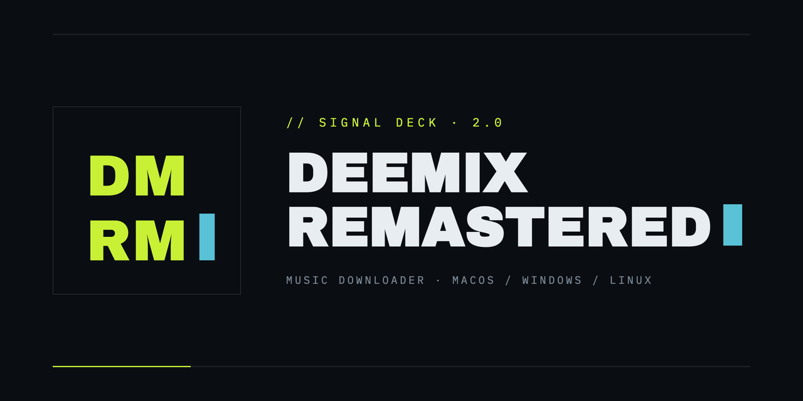
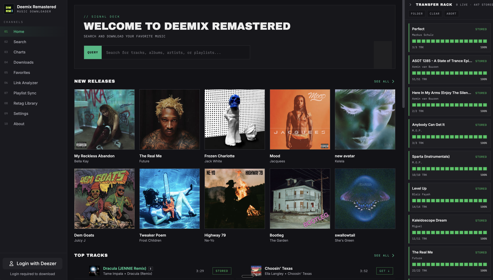
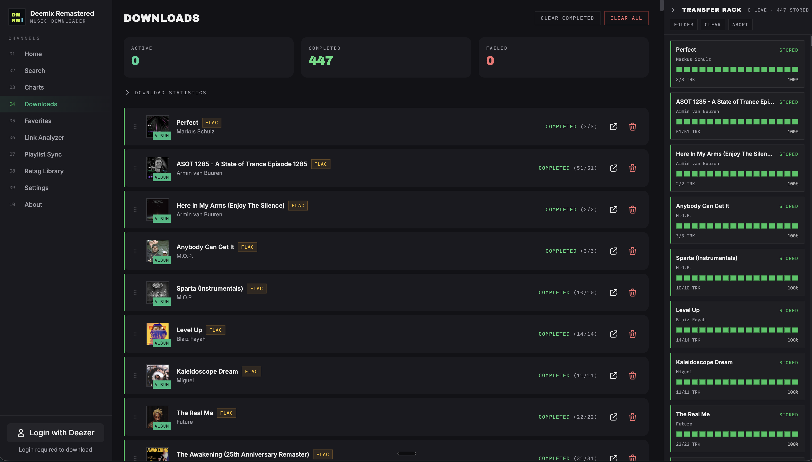
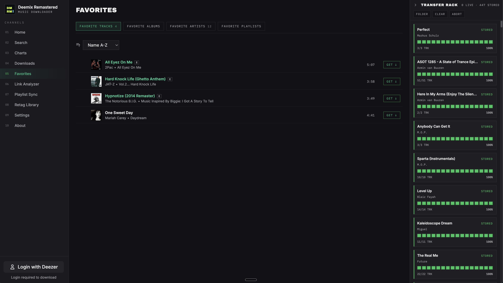
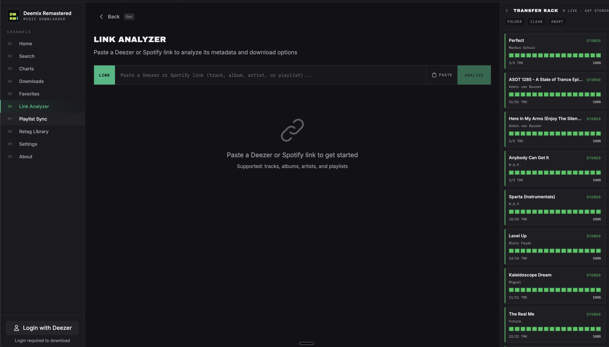
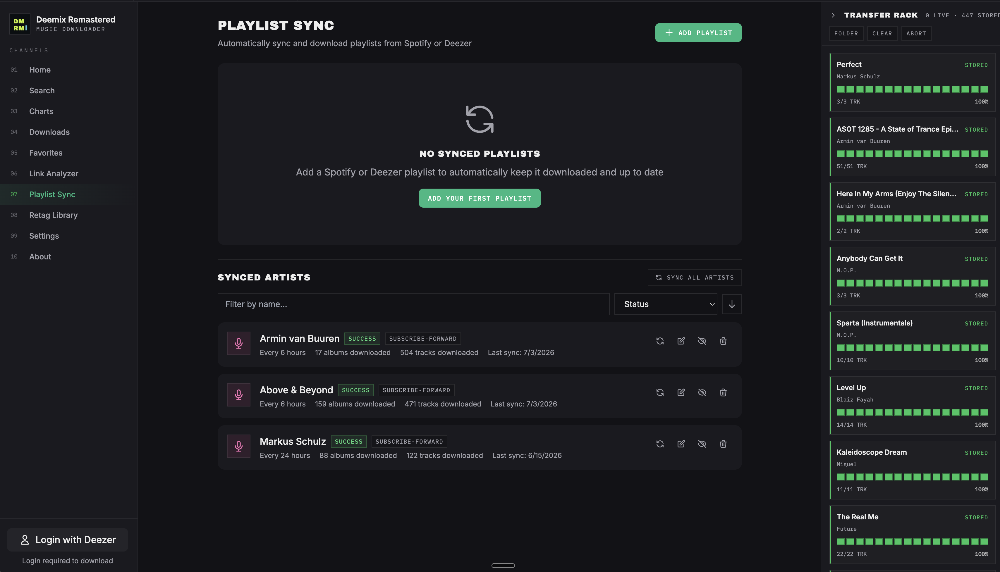
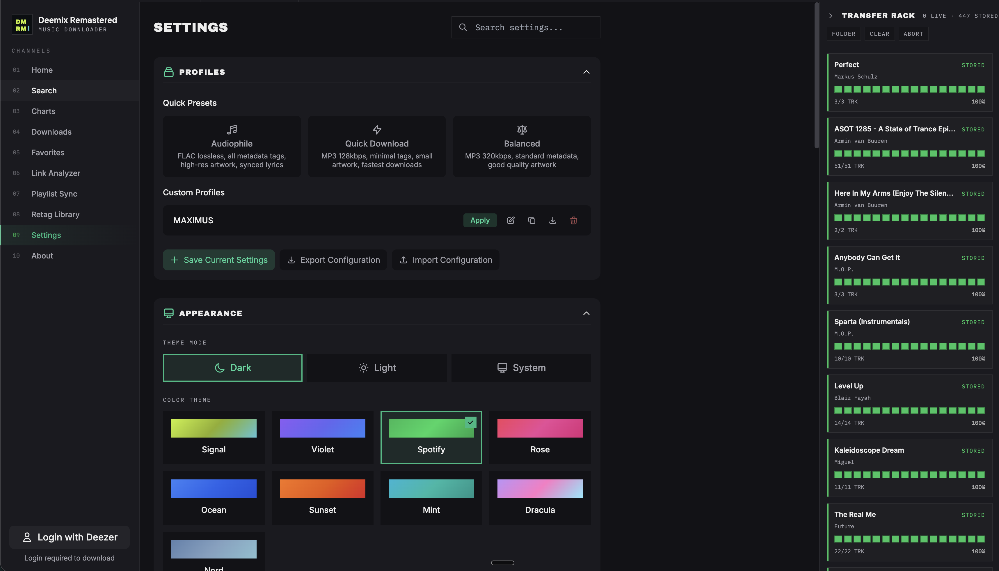

<p align="center">
  
</p>

<p align="center">
  A modern, cross-platform desktop music downloader built entirely from scratch with Electron, Vue 3, and TypeScript.
  <br />
  No code from the original Deemix project - just the same spirit, reimagined with a modern stack.
</p>

<p align="center">
  <strong>2.0 — "Signal Deck":</strong> a complete industrial-console redesign — acid chartreuse on blue-black, display type, hard edges, live telemetry everywhere — plus a new DM/RM identity. Every feature below carried over intact.
</p>

<p align="center">
  
  
  
  
  
  
</p>

---

## Features

### Qobuz Integration (v2.1.0) — True Hi-Res Downloads

- **Hi-Res FLAC up to 24-bit/192 kHz** -- Qobuz files come down DRM-free at the highest tier your plan and the track allow (paid Qobuz plan required)
- **Channel Q Discover Tab** -- A dedicated Qobuz home: your Purchases and Favorites up top, then Qobuz's editorial feeds (New Releases, Editor's Picks, Press Awards, Most Streamed) and playlists, with genre filter chips, per-row LOAD MORE, and SEE ALL full-catalog pages
- **Native Search & Browse** -- A Deezer/Qobuz source toggle on Search (sticky between sessions), Qobuz artist pages with release-type tabs (Albums/EPs/Singles/Compilations), album/playlist views, and 30-second track previews
- **Link Analyzer Support** -- Paste any Qobuz track, album, or playlist URL and download it directly
- **Quality Transparency** -- Album cards show each release's quality ceiling (e.g. 24/192, CD); every download reports the tier actually delivered (e.g. "FLAC 24/96"); tier step-down on repeated CDN stream failures happens only with Bitrate Fallback enabled — never silently
- **Full Settings Parity** -- Folder structure, naming templates, CD subfolders, artwork, the complete tagging option set, duplicate skip (by ISRC), overwrite modes, and playlist handling all apply to Qobuz exactly as they do to Deezer
- **Secure by Design** -- Your Qobuz session token lives only in OS secure storage — never in settings files, exports, or backups

### Music Discovery & Browsing

- **Home Dashboard** -- New releases, top tracks, top albums, and popular playlists at a glance
- **New Releases Page** -- Dedicated page showing all of Deezer's latest album releases (up to 100), accessible via the **See all** link in the Home page's New Releases section
- **Search** -- Find tracks, albums, artists, and playlists with tabbed result filtering and batch selection
- **Charts** -- Browse global and country-specific charts for tracks, albums, artists, and playlists
- **Artist Pages** -- Full discographies with filters for albums, EPs, singles, compilations, and featured-in releases, with sorting by name or date
- **Sorting** -- Sort favorites and artist discographies by name (A-Z, Z-A), date, or default order
- **Album & Playlist Views** -- Track listings with metadata, selective track downloads, and audio previews
- **Link Analyzer** -- Paste any Deezer, Spotify, or Qobuz URL to view content details and download directly (supports share links like `link.deezer.com`)
- **Favorites Import** -- Import your liked tracks, albums, artists, and playlists from your Deezer account

### Downloading

- **Audio Formats** -- MP3 128 kbps, MP3 320 kbps, and FLAC (lossless); Qobuz downloads reach hi-res FLAC up to 24-bit/192 kHz (v2.1.0+)
- **Batch Downloads** -- Download entire albums, playlists, or select individual tracks
- **Bulk Link Paste** -- Paste multiple Deezer links into the Search bar or anywhere in the app to queue them all at once
- **Batch Favorites** -- Download all your favorite tracks, albums, or playlists with one click
- **Three-Tier Track Resolution** -- Automatically finds alternative versions (FALLBACK, ISRC) when a track is unavailable — matches old Deemix behavior
- **Download Queue** -- Pause, resume, reorder (drag-and-drop), cancel, and retry downloads (retries stay grouped under the parent album/playlist)
- **Resume Interrupted Downloads on Startup** -- Optional, off by default: if a download was still going when you last closed the app, it continues automatically the next time you open it (already-downloaded tracks are skipped, so it picks up where it left off). Runs only once you're logged in (#98)
- **Download Next** -- Move pending items to the front of the download queue so they download first
- **Duplicate Album Detection** -- Warns when an album already exists on disk before downloading
- **Skip Duplicate Tracks (by ISRC)** -- Optional, off by default: before downloading, skip any recording you already have in your library — matched by ISRC, so it catches the same song appearing on a different album, single, or compilation. Tracks without an ISRC are always downloaded. Includes a one-click "Index existing library" backfill so it works on a pre-existing collection (v1.10.21+, #91/#92)
- **Live Batch Throughput** -- Album/playlist rows show their real combined download speed while running, mirrored in the sidebar sparkline and title-bar meter (v2.0.0+)
- **Alternate-Version Drill-Down** -- The "Alternate version" badge is clickable with a count and lists exactly which tracks were fulfilled from an ISRC-matched alternate release, in the Transfer Rack and in history (v2.0.0+)
- **Download Statistics** -- View total downloads, tracks, top artists, format breakdown, and weekly activity
- **Delete Files** -- Remove downloaded files directly from the app; deletes the entire playlist or album folder
- **Download History** -- Persistent log of all completed and failed downloads (last 500 entries)
- **Smart Fallbacks** -- Automatic bitrate and format fallback when preferred quality is unavailable
- **Concurrent Downloads** -- Configurable from 2 to 50 simultaneous downloads (default: 5)
- **Natural Download Pacing** -- Optional Off/Balanced/Cautious setting that adds small random delays between downloads so a large batch doesn't hit Deezer as one burst, reducing the chance of an "unusual activity" account flag (off by default; full speed unless enabled)
- **Conflict Handling** -- Skip, overwrite, or rename when files already exist
- **Playlist Diff** -- See how many tracks are new vs already downloaded before re-downloading a playlist
- **Timeout Protection** -- All HTTP calls have connection and stall timeouts to prevent downloads from hanging

### Metadata & Organization

- **ID3 Tagging** -- 26 configurable tag fields including title, artist, album, lyrics, ISRC, BPM, and more
- **Release Type Tag** -- Writes `RELEASETYPE` (Album / Single / EP / Compilation) so servers like Navidrome automatically separate albums, singles, and EPs; on by default and toggleable under Settings → Metadata tags (#82)
- **Featured Artists** -- All credited artists (main + featured) included in tags with configurable separator
- **M3U Playlists** -- Automatic M3U8 playlist file generation with paths matching actual downloaded files and customizable filename template (`%playlist%`, `%date%`, `%year%`)
- **Album Artwork** -- Embedded and local cover art with configurable size and format (JPEG/PNG)
- **Playlist Artwork** -- Playlist cover image saved as `cover.jpg` in the playlist folder (Deezer, Spotify, and Playlist Sync)
- **Synced Lyrics** -- Optional LRC file generation for synced lyrics
- **Folder Structure** -- Customizable templates for artist, album, playlist, and CD folder organization with variables like `%artist%`, `%album%`, `%year%`, `%explicit%`, `%owner%`, `%date%`, `%barcode%` / `%upc%`
- **Track Naming** -- Template-based naming with variables like `%artist%`, `%title%`, `%tracknumber%`, `%explicit%`
- **Explicit Tag** -- `%explicit%` variable in folder templates separates clean and explicit album versions into different folders
- **Barcode Disambiguation** -- `%barcode%` (alias `%upc%`) variable in folder templates keeps same-titled singles and albums in distinct folders (e.g. `abcd 0123456789012` vs `abcd 9876543210987`)

### Retag Library

- **Metadata-Only Retag** -- Point the Retag Library tool at a folder and it rewrites tags on your *existing* `.mp3`/`.flac` files — no re-download, and the audio stream is left byte-identical. Ideal for backfilling fields like UPC/Label or Release Type onto files downloaded before they were supported (#77, #82)
- **ISRC Matching** -- Each file is matched to Deezer by the ISRC already stored in its tags; files without an ISRC are listed and skipped (never guessed)
- **Public Catalog, No Account** -- Looks up metadata via Deezer's public API, so retagging needs no ARL/login and won't burn your download quota
- **Merge, Never Replace** -- Only the tags you enable are rewritten; all other tags and embedded artwork are preserved. UPC and Label are enabled by default
- **Dry-Run Preview** -- Preview exactly which tags would change, per file, before writing anything
- **Refresh Tags from an Album/Playlist** -- A "Refresh tags" button on every Album and Playlist view rewrites tags on files you already have, using the **exact** Deezer release you're viewing — so the barcode/label/genre always come from the right edition (no ISRC guesswork), with no re-download and audio untouched. It fills in every tag Deezer offers for that release; merge semantics preserve anything Deezer doesn't have
- **Clear Retag Results** -- The Retag Library reports per file whether each tag was written, was "Already up to date", or is "Not available on Deezer" (some albums genuinely have no genre upstream) — no silent skips
- **Retaggable Fields** -- UPC, Label, Release Type (RELEASETYPE), Genre, Track Length, Explicit, ISRC, Year, Date, BPM, track/disc numbers, album/artist/title — all from Deezer's public catalog

### Spotify Integration

- **Playlist Conversion** -- Convert Spotify playlists to Deezer for downloading
- **Track Matching** -- ISRC-based matching with fallback search and confidence scoring
- **Link Support** -- Paste Spotify URLs directly into the Link Analyzer
- **Batch Downloads** -- Converted playlists download as a single item with unified progress tracking
- **Public/Private Badge** -- Spotify playlists show visibility status in the Link Analyzer

### Playlist Sync

- **Automatic Sync** -- Monitor Spotify and Deezer playlists for new tracks
- **Scheduling** -- Sync on app launch, hourly, every 6/12/24 hours, or manually
- **Diff-Based Downloads** -- Only downloads tracks added since last sync; failed tracks are automatically retried on next sync
- **Force Full Sync** -- Right-click the sync button to reset and re-download all tracks in a playlist
- **Settings-Aware** -- Uses your configured quality, folder structure, and metadata settings
- **Real-Time Progress** -- Live progress bars and status updates during sync
- **One-Click Pin from Favorites** -- Each favorited playlist gets a **Sync** button + a 5-state status badge (Syncing X/Y, Synced, Partial, Sync error, Sync pending). A **Sync all favorite playlists** button at the top bulk-pins everything not already in sync.
- **Bulk Sync at Any Scale** -- A single bulk endpoint imports all favourite playlists in one request, so libraries with hundreds of favourites no longer get truncated by per-IP rate limits (v1.7.5+)
- **Editable Sync Entries** -- Every synced-playlist card has a pencil-icon button to rename the entry, change the sync schedule, or change the download folder (v1.7.4+)
- **Sort & Filter** -- Both the synced-playlists and synced-artists lists have their own name filter and sort menu (date added, name, last synced, status, or tracks downloaded) with an ascending/descending toggle, so a specific entry is easy to find in a long list. Sort choice is remembered between visits (v1.10.20+, #90)

### Artist Sync

- **Auto-Download New Releases** -- Pin an artist; the engine watches `/artist/{id}/albums` on a schedule and auto-downloads anything new
- **Three First-Sync Modes** -- `subscribe-forward` (default; safest — captures current discography as already-known without downloading anything, only future releases trigger downloads), `download-backlog` (download the entire filtered discography on first sync), `date-threshold` (download everything from a chosen release date forward)
- **Per-Artist Filters** -- Choose which release types to pull. Defaults: Albums ✓, EPs ✓, Singles ✗, Compilations ✗, Features ✗. Editable per artist from the Sync page (v1.7.5+) — toggle release types and set an optional "only download releases after" date threshold without touching the engine.
- **One-Click Pin from Favorites** -- Each favorited artist gets a **Pin to Sync** button + the same 5-state status badge as playlist sync. A **Sync all favorite artists** button bulk-pins everything.
- **Synced Artists Section on the Sync Page** -- Live per-artist progress (shows the current album being downloaded), failed-album expansion, force re-check (right-click), enable/disable, and remove.
- **Concurrent Sync Cap** -- Max 3 artists syncing in parallel; per-track downloads respect your existing `maxConcurrentDownloads` setting

### User Experience

- **"Signal Deck" Interface (v2.0.0)** -- Industrial-console design: live status-strip title bar (link LED, region, quality, throughput, clock), numbered channel-rail sidebar with download sparkline, a "Transfer Rack" download panel with 16-segment VU meters and status edge-lights, and a QUERY command-bar search with dense console rows
- **9 Color Themes** -- Signal (default), Violet, Spotify, Rose, Ocean, Sunset, Mint, Dracula, and Nord
- **Dark / Light / System Mode** -- Follows your OS preference or set manually; the Signal theme gets a dedicated light-mode "paper console" olive variant
- **Slim Sidebar** -- Compact navigation mode for more screen space
- **Keyboard Shortcuts** -- Quick access to search, downloads, settings, and more
- **Search History** -- Recent searches saved for quick access
- **Context Menus** -- Right-click support for copy/paste operations
- **Offline Detection** -- Banner notification when network connectivity is lost
- **Toast Notifications** -- Non-intrusive feedback for all user actions
- **Auto-Update Checker** -- Notifies you on startup when a new version is available
- **Download Progress in Title Bar** -- See overall download progress in the window title
- **Settings Profiles** -- Save, apply, export, and import named settings configurations (Audiophile / Quick / Balanced built-ins plus your own)
- **Backup and Restore Settings** -- A single backup file captures your entire local app data with per-segment selection: App preferences, Download profiles, Synced playlists, Synced artists, Favourites, and (optionally) Login info. v1.8.0 adds an expandable **per-profile picker** so you can back up or restore just the profiles you choose (e.g. only "Maximus", leaving "Drew" untouched). Restoring a profile whose name already exists overwrites in place; built-in name collisions fall back to a "(Restored)" suffix.

### Supported Languages

Arabic, Chinese (Simplified & Traditional), Croatian, English, Filipino, French, German, Greek, Indonesian, Italian, Korean, Polish, Portuguese (Brazil & Portugal), Russian, Serbian, Spanish, Thai, Turkish, and Vietnamese

### Security

- **Encrypted Credentials** -- ARL tokens, Spotify secrets, and the Qobuz session token stored using Electron safeStorage; the Qobuz token is never written to settings files, exports, or backups (v2.1.0+)
- **Recoverable, Bounded Deletes** -- "Delete Files" moves to the system Trash (never permanent), and the download root itself can never be deleted (v2.1.0+)
- **Path Traversal Protection** -- Download paths validated against directory traversal attacks
- **Session Management** -- Automatic expiration detection and re-authentication
- **SSRF Protection** -- Share link resolution validates redirect destinations against domain whitelist
- **URL Validation** -- External URLs validated before opening; blocks unsafe protocols
- **Error Sanitization** -- Internal server errors are sanitized before returning to the client
- **Sandboxed Windows** -- All browser windows use OS-level process isolation

---

## Screenshots

<p align="center">
  
  <br />
  <em>Home — The Signal Deck console: new releases and charts under the live status-strip title bar, with the Transfer Rack on the right</em>
</p>

<p align="center">
  
  <br />
  <em>Downloads — Status edge-lights, mono telemetry, and per-album completion, with the statistics dashboard one click away</em>
</p>

<p align="center">
  
  <br />
  <em>Favorites — Your Deezer favorites as console rows with GET ↓ buttons, sortable and filterable per tab</em>
</p>

<p align="center">
  
  <br />
  <em>Link Analyzer — Paste any Deezer, Spotify, or Qobuz URL into the LINK command bar for details and direct downloads</em>
</p>

<p align="center">
  
  <br />
  <em>Playlist &amp; Artist Sync — Pin playlists and artists to sync on a schedule; per-artist status badges, filters, and live progress</em>
</p>

<p align="center">
  
  <br />
  <em>Settings — Quick presets, custom profiles, export/import, and 9 color themes including the Signal default</em>
</p>

---

## Downloads

Pre-built binaries are available on the [Releases](../../releases) page.

| Platform | Architecture | Formats |
|----------|-------------|---------|
| **macOS** | Universal (Intel + Apple Silicon), ARM64 (Apple Silicon) | `.dmg` |
| **Windows** | x64, ARM64 | `.exe` (Installer), `.exe` (Portable) |
| **Linux** | x64, ARM64 | `.AppImage`, `.deb` |

### Release Files

#### macOS
- `Deemix Remastered-{version}-universal.dmg` -- Intel + Apple Silicon
- `Deemix Remastered-{version}-arm64.dmg` -- Apple Silicon only

#### Windows
- `Deemix Remastered-Setup-{version}-x64.exe` -- Installer (x64)
- `Deemix Remastered-Setup-{version}-arm64.exe` -- Installer (ARM64)
- `Deemix Remastered-Portable-{version}-x64.exe` -- Portable (x64)
- `Deemix Remastered-Portable-{version}-arm64.exe` -- Portable (ARM64)

#### Linux
- `Deemix Remastered-{version}.AppImage` -- AppImage (x64)
- `Deemix Remastered-{version}-arm64.AppImage` -- AppImage (ARM64)
- `deemix-app_{version}_amd64.deb` -- Debian/Ubuntu package (x64)
- `deemix-app_{version}_arm64.deb` -- Debian/Ubuntu package (ARM64)

---

## Getting Started

### 1. Install the App

Download the appropriate build for your platform from the [Releases](../../releases) page and install it.

### 2. Log In with Your Deezer ARL Token

A Deezer ARL (Authentication) token is required to download music:

1. Log in to [deezer.com](https://www.deezer.com) in your browser
2. Open Developer Tools (`F12`) and go to the **Application** tab
3. Under **Cookies** > `https://www.deezer.com`, find the `arl` cookie
4. Copy its value and paste it into the app's login dialog

> **Note:** A Deezer Premium or HiFi subscription is required for high-quality downloads (FLAC and 320 kbps).

### 2b. (Optional) Connect Qobuz for Hi-Res

Go to **Settings → Qobuz** and click **Connect** — a real Qobuz login window opens; sign in and you're done. Your session is stored encrypted on your machine. A paid Qobuz plan is required for downloads; hi-res tiers follow your plan.

### 3. Browse, Search, or Paste a Link

Use the search bar, browse charts and new releases (or the **Channel Q** tab for Qobuz), or paste a Deezer/Spotify/Qobuz URL into the Link Analyzer to find music.

### 4. Download

Click the download button on any track, album, or playlist and select your preferred quality.

### Keyboard Shortcuts

| Shortcut | Action |
|----------|--------|
| `Cmd/Ctrl + K` or `Cmd/Ctrl + F` | Focus search |
| `Cmd/Ctrl + D` | Go to downloads |
| `Cmd/Ctrl + ,` | Open settings |
| `Cmd/Ctrl + H` | Go to home |
| `Cmd/Ctrl + /` or `Cmd/Ctrl + Shift + ?` | Show shortcuts help |
| `Escape` | Close modals |

### Spotify Playlist Conversion

1. Go to **Settings** and enter your Spotify API credentials (Client ID and Secret)
2. Navigate to **Link Analyzer**
3. Paste a Spotify playlist or album URL
4. The app matches tracks to Deezer using ISRC codes with search fallback
5. Download the matched tracks

---

## Settings Overview

The Settings page offers deep customization organized into these categories:

| Category | Key Options |
|----------|-------------|
| **Appearance** | Theme (9 color themes, Signal default), dark/light/system mode, slim sidebar, slim downloads |
| **Downloads** | Quality (128/320/FLAC), max concurrent, natural download pacing, overwrite mode, bitrate fallback, M3U filename template |
| **Folder Structure** | Create artist/album/playlist/CD folders, templates with `%explicit%`, `%owner%`, `%date%` support |
| **Track Naming** | Templates for single tracks, album tracks, and playlist tracks |
| **Metadata Tags** | Toggle 21 individual ID3 tag fields (title, artist, album, lyrics, ISRC, BPM, etc.) |
| **Album Covers** | Save covers, embedded/local artwork size, JPEG quality, PNG option |
| **Text Processing** | Artist separator, date format, featured artists handling, title/artist casing |
| **Language** | Choose from 22 supported languages |
| **Account** | Deezer ARL token management |
| **Spotify** | Client ID, Client Secret, fallback search toggle |
| **Playlist Sync** | Add Spotify/Deezer playlists, set sync schedule, enable/disable |
| **Profiles** | Save, apply, export, import named settings configurations |
| **Backup and Restore Settings** | Full app-data backup file with per-segment selection (app preferences · download profiles · synced playlists · synced artists · favourites · login info) plus per-profile picker on both export and restore |

---

## Building from Source

### Prerequisites

- [Node.js](https://nodejs.org/) 20 or later
- [npm](https://www.npmjs.com/) 9 or later
- [Git](https://git-scm.com/)

**Building Linux `.deb` packages on macOS** additionally requires:

```bash
brew install dpkg fakeroot binutils
```

(`fpm` shells out to `ar`; macOS ships BSD ar which produces malformed Debian archives. The repo includes a `scripts/build-tools/ar` shim that redirects to GNU ar from `binutils` when running on macOS — the npm scripts wire it in automatically.)

### Setup

```bash
git clone https://github.com/DRAZY/deemix-remastered.git
cd deemix-remastered
npm install
```

### Development

```bash
# Start the Vite dev server + Electron
npm run electron:dev

# Or start just the Vite dev server (web only)
npm run dev
```

### Build

```bash
# Build for the current platform
npm run build

# Platform-specific builds
npm run build:mac          # macOS Universal (Intel + Apple Silicon)
npm run build:mac-arm64    # macOS Apple Silicon only
npm run build:win          # Windows x64
npm run build:win-arm64    # Windows ARM64
npm run build:linux        # Linux x64
npm run build:linux-arm64  # Linux ARM64

# Build all platforms
npm run build:all
```

Build output is written to the `release/` directory.

---

## Documentation

- **[Architecture](docs/ARCHITECTURE.md)** — How the renderer, preload bridge, and main process fit together, with a diagram and walkthroughs of common data flows
- **[Troubleshooting](docs/TROUBLESHOOTING.md)** — Solutions for login issues, download failures, M3U glitches, Spotify integration, and more

---

## Project Structure

```
deemix-remastered/
├── src/                        # Vue frontend
│   ├── assets/                 # Global styles
│   │   └── main.css                # Tailwind layers + the CSS-variable theme system (Signal + 8 more, light-mode variants)
│   ├── components/             # Reusable UI components (21)
│   ├── composables/            # Composition functions
│   │   ├── useContextMenu.ts       # Right-click menu handling
│   │   ├── useKeyboardShortcuts.ts # Global keyboard shortcuts
│   │   ├── useNetworkStatus.ts     # Online/offline detection
│   │   └── useSearchHistory.ts     # Search history management
│   ├── directives/             # Custom Vue directives
│   │   └── tooltip.ts              # v-tooltip
│   ├── i18n/locales/           # Translation files (21 languages)
│   ├── services/               # API services
│   │   └── deezerAPI.ts            # Deezer API wrapper with caching
│   ├── stores/                 # Pinia state stores
│   │   ├── authStore.ts            # Authentication & session
│   │   ├── backupStore.ts          # Backup & Restore (#72)
│   │   ├── downloadStore.ts        # Download queue management & history
│   │   ├── favoritesStore.ts       # Favorites tracking & Deezer import
│   │   ├── playerStore.ts          # Audio preview playback
│   │   ├── profileStore.ts         # Settings profiles
│   │   ├── settingsStore.ts        # User preferences & export/import
│   │   ├── syncStore.ts            # Playlist sync state (bulk + restore)
│   │   ├── artistSyncStore.ts      # Artist sync state (bulk + restore)
│   │   └── toastStore.ts           # Notification system
│   ├── types/                  # TypeScript type definitions
│   └── views/                  # Page components (14 pages)
├── electron/                   # Electron main process
│   ├── main.ts                 # Window management & IPC
│   ├── preload.ts              # Context bridge
│   ├── server.ts               # Backend server
│   └── services/               # Backend services
│       ├── deezerAuth.ts           # Deezer authentication
│       ├── downloader.ts           # Download engine (writes tags on download)
│       ├── retagger.ts             # Retag engine — metadata-only rewrite of existing files (#77)
│       ├── playlistSync.ts         # Playlist sync engine
│       ├── artistSync.ts           # Artist sync engine (#61)
│       ├── spotifyAPI.ts           # Spotify API client
│       └── spotifyConverter.ts     # Spotify-to-Deezer conversion
├── docs/                       # Documentation
│   ├── ARCHITECTURE.md             # Renderer / preload / main-process walkthrough
│   ├── TROUBLESHOOTING.md          # Common issues & fixes
│   ├── redesign/                   # Signal Deck design mockups (2.0 provenance)
│   └── screenshots/                # README screenshots
├── public/                     # Static assets & icons (DM/RM icon: .icns / .ico / .png + iconset)
├── dist/                       # Built frontend (generated)
├── dist-electron/              # Built Electron code (generated)
└── release/                    # Packaged builds (generated)
```

---

## Versioning

This project follows [Semantic Versioning](https://semver.org/):

- **PATCH** (e.g., 1.0.1) -- Bug fixes, security patches, dependency updates, translation fixes
- **MINOR** (e.g., 1.1.0) -- New features, new themes, new language support
- **MAJOR** (e.g., 2.0.0) -- Breaking changes, major redesigns, architecture overhauls

See the [Releases](../../releases) page for the full changelog.

---

## Contributing

1. Fork the repository
2. Create a feature branch (`git checkout -b feature/my-feature`)
3. Commit your changes (`git commit -m 'Add my feature'`)
4. Push to the branch (`git push origin feature/my-feature`)
5. Open a Pull Request

Please open an [issue](../../issues) first for major changes to discuss the approach.

---

## License

This project is licensed under the [GPL-3.0 License](LICENSE).

---

## Disclaimer

This application is not affiliated with or endorsed by Deezer or Spotify. Use responsibly and in accordance with your local laws regarding music downloading. Please respect copyright laws and the terms of service of music streaming platforms.

---

<p align="center">
  Made with care by <strong>Team MAXIMUS</strong>
</p>
